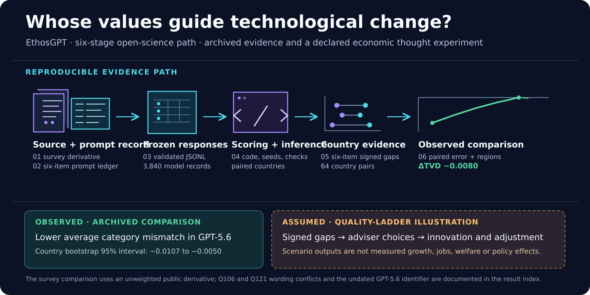
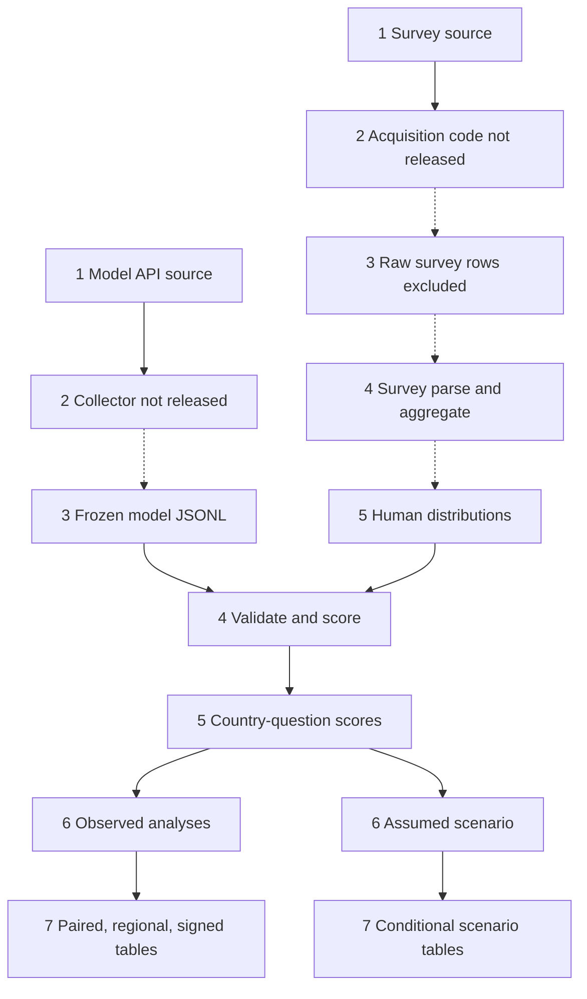

<div align="center">

# EthosGPT

**Whose values does an AI adviser represent when technological change affects different places?**

[](LICENSE)
[](REPRODUCIBILITY.md)
[](docs/result_index.md)



</div>

EthosGPT is a **reproducible code, archived data, and editable figure package**
for studying whose values an AI adviser represents across model updates. It
compares two archived model versions with an
unweighted public World Values Survey derivative in **64 countries, eight
descriptive cultural regions, and six questions**. Five responses per
country–question–model cell yield **3,840 validated model records**.

The observed average category mismatch is smaller for GPT-5.6 Sol:
**ΔTVD = −0.0080** relative to GPT-5.5 (95% country-bootstrap interval
**−0.0107 to −0.0050**). That aggregate improvement does not tell us whether
every country or question is represented better. The released signed
country scores and regional views show the differences.

<a id="start"></a>
## Start here

Use Python 3.12 and `make`. Installation may need a package index; the
commands after installation use only the files in this repository.

```bash
python3 -m venv .venv
source .venv/bin/activate
python -m pip install -r requirements.lock.txt
make release-smoke          # fast checks of frozen hashes, coverage and result paths
make reproduce-offline      # rebuild analyses and editable SVG figures
make release-contract       # tests, reference checks and visual-asset audit
```

The full run includes 20,000 country-bootstrap draws, 19,999 sign flips and
spatial analyses. It needs no model API key. A later live call to the undated
`gpt-5.6-sol` identifier is outside the exact-reproduction claim. See
[the complete command and environment guide](REPRODUCIBILITY.md).

<a id="repository-map"></a>
## Repository map

This table covers every top-level folder and file. Follow the linked directories for their contents; the [result index](docs/result_index.md) maps individual findings to exact inputs, code, and outputs.

| Folder | What it contains |
|---|---|
| [`.github/`](.github/) | GitHub Actions workflows for offline reproduction and release checks. |
| [`assets/`](assets/) | Featured overview, editable figure source scripts and data, provenance manifests, and technical clip art. Start with [`assets/featured/README.md`](assets/featured/README.md). |
| [`config/`](config/) | YAML definitions for constructs, countries, languages, models, prompts, dataset, and the illustrative simulation. |
| [`data/`](data/) | Country/item/language crosswalks and processed or analysis-ready Parquet data. The `raw/`, `external/`, and `interim/` folders contain boundary notes; raw WVS respondent data are not bundled. |
| [`docs/`](docs/) | Data and model pipeline guides, result index, replication report, and statistical appendix. |
| [`experiments/`](experiments/) | The archived [64-country GPT-5.5/GPT-5.6 Sol comparison](experiments/gpt55_gpt56_64country/): inputs, frozen outputs, manifests, scoring and sensitivity scripts, and result tables. |
| [`manifests/`](manifests/) | [Machine-readable result replication index](manifests/result_replication_index.json) tracing headline outputs through source, collection boundary, processing, and analysis. |
| [`prompts/`](prompts/) | English prompt template, response schema, prompt manifest, and multilingual guidance; exact study prompts and ledger are also under `experiments/`. |
| [`results/`](results/) | Released scenario tables, signed country and regional differences, and generated SVG/PDF figure exports. For editable inputs, see [`assets/figure_sources/`](assets/figure_sources/). |
| [`scripts/`](scripts/) | Offline reproduction driver, release and visual checks, and figure generators. |
| [`src/`](src/) | Python package namespace and pipeline module; the comparison's executable analysis is primarily under `experiments/` and `scripts/`. |
| [`tests/`](tests/) | Tests for metrics, small-sample inference, extended analysis, and negative release checks. |

| Root file | What it does |
|---|---|
| [`.env.example`](.env.example) | Optional live-call environment-variable template. Offline reproduction does not require API keys. |
| [`.gitignore`](.gitignore) | Excludes local secrets, environments, caches, raw-data drop-ins, build output, and document-source files. |
| [`CITATION.cff`](CITATION.cff) | Machine-readable software citation metadata for GitHub's citation panel. |
| [`DATA_LICENSE.md`](DATA_LICENSE.md) | Data provenance, source rights, derivative limits, and reuse guidance. |
| [`Dockerfile`](Dockerfile) | Python 3.12 container recipe that installs pinned dependencies and runs offline reproduction. |
| [`LICENSE`](LICENSE) | MIT license for repository code and original vector assets; data rights are described separately. |
| [`Makefile`](Makefile) | Entry points for analysis, figures, smoke checks, tests, verification, and offline reproduction. |
| [`README.md`](README.md) | This landing page: research scope, key findings, quick start, figure guide, and repository map. |
| [`REPRODUCIBILITY.md`](REPRODUCIBILITY.md) | Detailed environment, commands, archived inputs, validation, and evidence boundaries. |
| [`environment.yml`](environment.yml) | Conda environment specifying Python 3.12 and the pinned pip requirements. |
| [`pyproject.toml`](pyproject.toml) | Python package metadata, declared dependencies, build settings, and pytest configuration. |
| [`requirements.lock.txt`](requirements.lock.txt) | Exact pip versions used by the documented reproduction environment. |
| [`requirements.txt`](requirements.txt) | Convenience pip entry point that includes `requirements.lock.txt`. |

<a id="findings"></a>
## What the evidence says

| Reader question | Released evidence | How to read it |
|---|---|---|
| Did the update reduce category disagreement? | [Global paired results](experiments/gpt55_gpt56_64country/results/metric_comparisons.csv) | TVD falls by 0.0080 on average across countries. W1 and the other global targets have intervals crossing zero after the stated corrections. |
| Which views shifted, and in which direction? | [Six signed questions by country](results/signed_directions/signed_country_items.csv) and [region](results/signed_directions/signed_eight_regions.csv) | A positive model-minus-survey score means more of the named endpoint. It is a comparison of response distributions, not a judgment about a population. |
| How uneven are the geographic patterns? | [Eight-region W1/TVD table](experiments/gpt55_gpt56_64country/results/eight_region_sensitivity.csv) and [figure guide](results/region_figures/README.md) | The original region labels group 2–15 countries; intervals are exploratory and omitted when fewer than five countries enter. |
| Could a misrepresented profile matter for creative destruction? | [Declared scenario equations and sensitivities](results/creative_destruction/README.md) and [all country scenarios](results/creative_destruction/country_simulation.csv) | These are conditional calculations under chosen adviser and innovation rules, not measured growth, jobs or policy impacts. |
| What could change the interpretation? | [Wording omissions](experiments/gpt55_gpt56_64country/results/wording_omission_sensitivity.csv), [spatial checks](experiments/gpt55_gpt56_64country/results/spatial_hac_contrasts.csv) and [statistical appendix](docs/STATISTICAL_ANALYSIS_REPORT.md) | Q106 and Q121 have archived prompt-label conflicts; item omission is not a corrected re-query. |

TVD, or *total-variation distance*, measures how far apart two distributions
over the answer choices are, from zero (same shares) to one (no overlap).
The reported ΔTVD subtracts GPT-5.5 error from GPT-5.6 Sol error, so a
negative value means the newer archived output is closer to the survey
distribution on this measure.

<a id="figures"></a>
## Featured visuals

The [visual guide](assets/featured/README.md) explains evidence classes and
links editable SVGs, vector PDF exports, input CSVs and provenance.

| Visual | What it helps a reader see |
|---|---|
| [Figure 1 · country, region and direction](results/figures/fig1_ethos_gallery.svg) | Sampled countries, eight descriptive regional contrasts, six signed question gaps, and an explicitly assumed African–Islamic scenario. |
| [Figure 2 · values to technological change](results/figures/fig2_value_bridge.svg) | Measured Nigerian answer gaps, assumed adviser choices, the quality-ladder mechanism, and contrasting Nigeria/Kenya scenario values. |

Regenerate the two editable figure masters with `make featured-figures`.
The SVGs retain live text; source scripts and figure data are under
[`assets/figure_sources/`](assets/figure_sources/README.md).

<a id="mechanism"></a>
## From representation to a testable economic question

The six questions concern agency (Q48), trust (Q57), income equality (Q106),
individual responsibility (Q108), immigration (Q121), and science (Q159).
In the **illustrative** rule, their zero-to-one scores map to innovation
support `i`, transition assistance `a`, and coordination `s`:

```text
i = 0.5 + 0.30 × (agency + science − 1)
a = 0.5 + 0.30 × (equality − individual provision)
s = 0.5 + 0.30 × (trust + immigration − 1)
arrival = 0.05 + 0.20i + 0.10s
20-round expected log-quality = 20 × arrival × log(1.04)
unassisted-transition index per 100 = 100 × arrival × (1 − a)
```

Under those declared coefficients, the GPT-5.6 Sol profile implies a
**−1.69 percentage-point** 20-round quality gap relative to survey-guided
choices for Nigeria and **+0.70** for Kenya. The African–Islamic average
contains both and should not stand in for either country. These quantities
are synthetic proxies. The code also evaluates weak, strong, two-item
neutralization and no-decision-link scenarios; none identifies an actual
economic or environmental effect.

<a id="replication"></a>
## Trace each result

The [human-readable result index](docs/result_index.md) and
[machine-readable result map](manifests/result_replication_index.json)
connect each headline finding to its source, collection boundary, frozen
inputs, processing code, analysis code, output, and interpretation limit.
The featured visual above summarizes this path in six broad steps. The
table below uses seven labels to distinguish analysis code from analyzed
outputs and shows the survey and model streams before they meet.

| Stage | Concrete source, code, or data | Reproduction boundary |
|---|---|---|
| **1. Data source** | [Pinned Oxford WVS 2017–2022 derivative](https://huggingface.co/datasets/oxford-llms/world_values_survey_2017_2022_sft/tree/026d11792ba88decb0b1198116a57745a8132433) for survey answers; GPT-5.5 and GPT-5.6 Sol Responses API collection recorded in the [collection manifest](experiments/gpt55_gpt56_64country/manifests/collection_manifest.json). | The survey comparison uses an **unweighted public derivative**, not official WVS microdata. |
| **2. Query data code** | The [questionnaire and prompt templates](experiments/gpt55_gpt56_64country/inputs/questionnaire_and_prompts.json), [prompt ledger](experiments/gpt55_gpt56_64country/inputs/prompt_ledger.csv), and [collection manifest](experiments/gpt55_gpt56_64country/manifests/collection_manifest.json) document the model requests. | The original authenticated API collector and acquisition script for the upstream survey derivative are **not released**. The archived contract cannot replay provider-side collection. |
| **3. Queried data** | [GPT-5.5 JSONL](experiments/gpt55_gpt56_64country/outputs/gpt-5.5_scores.jsonl) and [GPT-5.6 Sol JSONL](experiments/gpt55_gpt56_64country/outputs/gpt-5.6-sol_scores.jsonl), with [attempt ledger](experiments/gpt55_gpt56_64country/outputs/attempt_ledger.jsonl) and [hash/coverage manifest](experiments/gpt55_gpt56_64country/manifests/analysis_manifest.json). | **3,840 validated model records** are frozen. Raw survey respondent records are excluded; the released human comparison begins at stage 5. |
| **4. Process data code** | [Survey parser and aggregator](src/ethosgpt/pipeline.py) for separately acquired inputs; [scoring code](experiments/gpt55_gpt56_64country/score_wave1.py) validates model records, aligns answer scales, and averages five generations per country–question cell. See the [data pipeline note](docs/data_pipeline.md). | The broader survey transform requires upstream files absent from this package. The default offline command starts from the released human aggregate and frozen model JSONL. |
| **5. Processed data** | [Human country–item distributions](data/processed/human_item_distributions.parquet), [item dictionary](data/metadata/item_dictionary.csv), and [matched country–question scores](experiments/gpt55_gpt56_64country/results/country_question_scores.csv). | These are the released inputs and intermediate table for the 64-country, six-question comparison. |
| **6. Analyze data code** | [Paired metrics](experiments/gpt55_gpt56_64country/score_wave1.py), [eight-region sensitivity](experiments/gpt55_gpt56_64country/eight_region_sensitivity.py), [signed directions](experiments/gpt55_gpt56_64country/signed_directions.py), and [wording sensitivity](experiments/gpt55_gpt56_64country/wording_sensitivity.py) examine heterogeneity and robustness. The [creative-destruction simulator](experiments/gpt55_gpt56_64country/simulate_creative_destruction.py) runs a separate assumed scenario. | `make reproduce-offline` runs the released analysis without API keys; the scenario is a declared calculation, not an observed economic outcome. |
| **7. Analyzed data** | [Global paired comparisons](experiments/gpt55_gpt56_64country/results/metric_comparisons.csv), [eight-region contrasts](experiments/gpt55_gpt56_64country/results/eight_region_sensitivity.csv), [signed country items](results/signed_directions/signed_country_items.csv), and [vector figures](results/figures/). The [country scenario table](results/creative_destruction/country_simulation.csv) is labeled separately. | Metrics, regions, and signed answers are **derived from archived observations**; quality-ladder outputs are **synthetic and conditional**. |



Dashed arrows mark acquisition or survey-preprocessing handoffs that cannot
be rerun from bundled raw inputs. Solid arrows from the released human
aggregate and frozen model JSONL mark the supported offline route:
`make reproduce-offline` followed by `make release-contract`.
The [result index](docs/result_index.md) names the exact command and evidence
status for each finding.

The derivative does not provide official population weights or full upstream
respondent provenance. No raw respondent narratives or official joint
EVS/WVS microdata are bundled. Country averages cannot describe every
individual, and survey agreement alone does not establish local legitimacy.
The [data rights and use note](DATA_LICENSE.md) and [reproducibility guide](REPRODUCIBILITY.md)
spell out these boundaries.

<a id="cite"></a>
## Cite and reuse

Code and original vector assets use the [MIT License](LICENSE); source-data
rights are recorded separately in [DATA_LICENSE.md](DATA_LICENSE.md). Use
[`CITATION.cff`](CITATION.cff) for software citation. Result tables,
archived outputs and figure masters remain directly inspectable here.
